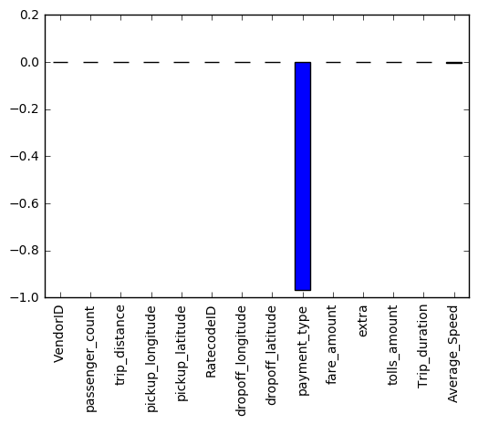
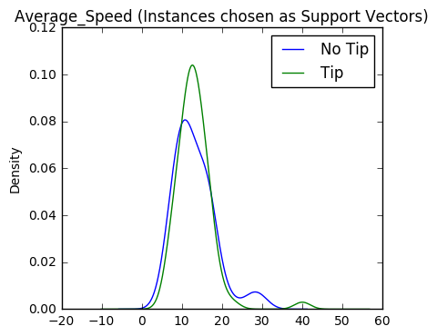
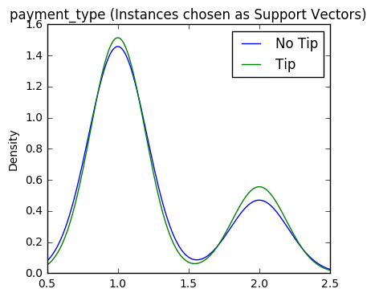

# Prediciting Gratuity using Logistic Regression and SVM


## Introduction

NYC Taxi and Limousine Commission (TLC) collects all trip data for Yellow, Green, and For-Hire-Vehicles (FHV). Trip data is published monthly and available on this website: http://www.nyc.gov/html/tlc/html/about/trip_record_data.shtml Since February is nearing, we would like to spend some time analyzing February of 2016 Yellow Cab trip data. In particular with Superbowl 2017 approaching, we would like to analyze trip data for Superbowl Sunday in 2016. Although, Superbowl 2016 was not in New York, we would like to see if there is an impact of a large sporting event watched by many on the taxi industry in NYC.

- For this portion of the project we will try and predict whether or not a patron will leave a tip.There is obvious business use for determining what factors lead to an increase in tip frequency. 

### Datset Description

February 2016 Yellow Cab Data set is available for download on this website http://www.nyc.gov/html/tlc/html/about/trip_record_data.shtml. This dataset has over 11 million records and each record has 19 columns. The data dictionary for the dataset is available here: http://www.nyc.gov/html/tlc/downloads/pdf/data_dictionary_trip_records_yellow.pdf The dataset offers some intersting information in ragards to the passenger counts, trip distance, pick and dropoff locations, fare amounts, pick up and drop off times. The basic information in regards to the dataset is available below.

VendorID - cab ID
tpep_pickup_datetime.1 - Time of Pickup
tpep_dropoff_datetime - Time of Dropoff
passenger_count	- Passenger Count
trip_distance - distance of Trip
pickup_longitude - Pickup location
pickup_latitude	- Pickup location
RatecodeID - Rate code given for type of trip	
dropoff_longitude - Dropoff Location	
dropoff_latitude - Dropoff Location	
payment_type - Type of payment
fare_amount	- fare
extra - surcharges	
tip_amount - tip given to driver	
tolls_amount - whether or not they went on a toll road	
total_amount - total(all charges summed)		
Trip_duration - length of trip	
Average_Speed - Average speed in mph


```python
import pandas as pd
import sklearn 
from sklearn import linear_model
import numpy as np
from sklearn import metrics
from sklearn import cross_validation
from sklearn.preprocessing import scale
from sklearn.linear_model import LinearRegression
from sklearn.linear_model import LogisticRegression
from sklearn.preprocessing import StandardScaler

from matplotlib import pyplot as plt
%matplotlib inline
```


```python
df = pd.read_csv("Superbowl.csv")# this is the already cleaned dataset from the Superbowl Exploratory Data Analysis
```


```python
df.head()
```


<div>
<table border="1" class="dataframe">
  <thead>
    <tr style="text-align: right;">
      <th></th>
      <th>tpep_pickup_datetime</th>
      <th>VendorID</th>
      <th>tpep_pickup_datetime.1</th>
      <th>tpep_dropoff_datetime</th>
      <th>passenger_count</th>
      <th>trip_distance</th>
      <th>pickup_longitude</th>
      <th>pickup_latitude</th>
      <th>RatecodeID</th>
      <th>dropoff_longitude</th>
      <th>dropoff_latitude</th>
      <th>payment_type</th>
      <th>fare_amount</th>
      <th>extra</th>
      <th>tip_amount</th>
      <th>tolls_amount</th>
      <th>total_amount</th>
      <th>Trip_duration</th>
      <th>Average_Speed</th>
    </tr>
  </thead>
  <tbody>
    <tr>
      <th>0</th>
      <td>16</td>
      <td>2</td>
      <td>2016-02-07 16:20:13</td>
      <td>2016-02-07 16:24:10</td>
      <td>1</td>
      <td>0.81</td>
      <td>-73.956573</td>
      <td>40.777836</td>
      <td>1</td>
      <td>-73.963730</td>
      <td>40.768036</td>
      <td>1</td>
      <td>5.0</td>
      <td>0.0</td>
      <td>0.00</td>
      <td>0.0</td>
      <td>5.80</td>
      <td>3.950000</td>
      <td>12.303797</td>
    </tr>
    <tr>
      <th>1</th>
      <td>16</td>
      <td>2</td>
      <td>2016-02-07 16:20:13</td>
      <td>2016-02-07 16:24:58</td>
      <td>5</td>
      <td>0.66</td>
      <td>-74.002708</td>
      <td>40.718124</td>
      <td>1</td>
      <td>-74.009361</td>
      <td>40.710178</td>
      <td>1</td>
      <td>5.0</td>
      <td>0.0</td>
      <td>1.16</td>
      <td>0.0</td>
      <td>6.96</td>
      <td>4.750000</td>
      <td>8.336842</td>
    </tr>
    <tr>
      <th>2</th>
      <td>16</td>
      <td>2</td>
      <td>2016-02-07 16:20:14</td>
      <td>2016-02-07 16:37:27</td>
      <td>1</td>
      <td>2.79</td>
      <td>-73.998100</td>
      <td>40.722713</td>
      <td>1</td>
      <td>-73.951157</td>
      <td>40.710224</td>
      <td>2</td>
      <td>14.0</td>
      <td>0.0</td>
      <td>0.00</td>
      <td>0.0</td>
      <td>14.80</td>
      <td>17.216667</td>
      <td>9.723136</td>
    </tr>
    <tr>
      <th>3</th>
      <td>16</td>
      <td>2</td>
      <td>2016-02-07 16:20:14</td>
      <td>2016-02-07 16:32:12</td>
      <td>3</td>
      <td>2.27</td>
      <td>-73.987732</td>
      <td>40.738522</td>
      <td>1</td>
      <td>-73.981857</td>
      <td>40.764629</td>
      <td>2</td>
      <td>10.5</td>
      <td>0.0</td>
      <td>0.00</td>
      <td>0.0</td>
      <td>11.30</td>
      <td>11.966667</td>
      <td>11.381616</td>
    </tr>
    <tr>
      <th>4</th>
      <td>16</td>
      <td>2</td>
      <td>2016-02-07 16:20:14</td>
      <td>2016-02-07 16:25:58</td>
      <td>1</td>
      <td>1.42</td>
      <td>-73.985939</td>
      <td>40.777916</td>
      <td>1</td>
      <td>-73.995277</td>
      <td>40.761211</td>
      <td>2</td>
      <td>7.0</td>
      <td>0.0</td>
      <td>0.00</td>
      <td>0.0</td>
      <td>7.80</td>
      <td>5.733333</td>
      <td>14.860465</td>
    </tr>
  </tbody>
</table>
</div>


```python
df['trip_distance'] = df['trip_distance'].apply(np.log) 
df['fare_amount'] = df['fare_amount'].apply(np.log) 
df['tip_amount'] = (df['tip_amount']+1).apply(np.log) 
df['total_amount'] = df['total_amount'].apply(np.log) 

df.drop(['tpep_dropoff_datetime','tpep_pickup_datetime','tpep_pickup_datetime.1' ], axis = 1, inplace = True, errors = 'ignore')
```

# Logistic Regression

- defining x and y


```python
Y_log = df['tip_amount'].astype(bool)
X_log = df.drop(['tip_amount'], axis = 1, inplace = True, errors = 'ignore')
```


```python
X_log = df.columns.values.tolist()
LogX = df[X_log]
```


```python
logicR = LogisticRegression(C=1.0, class_weight=None, dual=False, fit_intercept=True,
          intercept_scaling=1, max_iter=100, multi_class='ovr', n_jobs=1,
          penalty='l2', random_state=None, solver='liblinear', tol=0.0001,
          verbose=0, warm_start=False)
X_train, X_test , y_train, y_test = cross_validation.train_test_split(LogX, Y_log, test_size=0.2, random_state=1)
score = cross_validation.cross_val_score(logicR, X_train, y_train, scoring='accuracy', cv=10)
```


```python
score.mean()
```


    0.98945968978403598


### Decreasing Regularization Strength
- C changed to values between 1 - 100, and the model appears to fit better when C is around 30. Will keep C larger for further analysis


```python
logicR = LogisticRegression(C=10.0, class_weight=None, dual=False, fit_intercept=True,
          intercept_scaling=1, max_iter=100, multi_class='ovr', n_jobs=1,
          penalty='l2', random_state=None, solver='liblinear', tol=0.0001,
          verbose=0, warm_start=False)
X_train, X_test , y_train, y_test = cross_validation.train_test_split(LogX, Y_log, test_size=0.2, random_state=1)
score = cross_validation.cross_val_score(logicR, X_train, y_train, scoring='accuracy', cv=10)
score.mean()
```


    0.99257834192307848


```python
logicR.fit(X_train, y_train)

```


    LogisticRegression(C=10.0, class_weight=None, dual=False, fit_intercept=True,
              intercept_scaling=1, max_iter=100, multi_class='ovr', n_jobs=1,
              penalty='l2', random_state=None, solver='liblinear', tol=0.0001,
              verbose=0, warm_start=False)


```python
weights = logicR.coef_.T
var_names = LogX.columns
for weight, name in zip(weights, var_names):
    print(name ,'has weight of:', weight)

```

    VendorID has weight of: [-0.55237485]
    passenger_count has weight of: [-0.01057591]
    trip_distance has weight of: [-0.47232027]
    pickup_longitude has weight of: [ 0.65880061]
    pickup_latitude has weight of: [-0.75462035]
    RatecodeID has weight of: [-1.42349804]
    dropoff_longitude has weight of: [-1.65320413]
    dropoff_latitude has weight of: [-1.29010879]
    payment_type has weight of: [-10.18873507]
    fare_amount has weight of: [-40.5312671]
    extra has weight of: [-5.10299564]
    tolls_amount has weight of: [-0.00031252]
    total_amount has weight of: [ 48.90533429]
    Trip_duration has weight of: [-0.14286575]
    Average_Speed has weight of: [-0.00330512]
    


```python
pred = logicR.predict(X_test)
print(metrics.classification_report(y_test, pred))
```

                 precision    recall  f1-score   support
    
          False       0.99      0.99      0.99     94056
           True       1.00      1.00      1.00    172732
    
    avg / total       1.00      1.00      1.00    266788
    
    

### Sweet Spot Chosen for Reg Strength

- eventually the sweet spot was found to be around 30, not class weight was also hanged to balanced after observing an increase in fit.


```python
logicR = LogisticRegression(C=30.0, class_weight='balanced', dual=False, fit_intercept=True,
          intercept_scaling=1, max_iter=100, multi_class='ovr', n_jobs=1,
          penalty='l2', random_state=None, solver='liblinear', tol=0.0001,
          verbose=0, warm_start=False)
```


```python
X_train, X_test , y_train, y_test = cross_validation.train_test_split(LogX, Y_log, test_size=0.2, random_state=1)
score = cross_validation.cross_val_score(logicR, X_train, y_train, scoring='accuracy', cv=10)

scl_obj = StandardScaler()
scl_obj.fit(X_train) 

X_train_scaled = scl_obj.transform(X_train) 
X_test_scaled = scl_obj.transform(X_test) 
```


```python
score.mean()
```


    0.99674649401976601


```python
logicR.fit(X_train, y_train)


```


    LogisticRegression(C=30.0, class_weight='balanced', dual=False,
              fit_intercept=True, intercept_scaling=1, max_iter=100,
              multi_class='ovr', n_jobs=1, penalty='l2', random_state=None,
              solver='liblinear', tol=0.0001, verbose=0, warm_start=False)


```python
weights = logicR.coef_.T
var_names = LogX.columns
for weight, name in zip(weights, var_names):
    print(name ,'has weight of:', weight)
```

    VendorID has weight of: [-0.76489998]
    passenger_count has weight of: [-0.00753584]
    trip_distance has weight of: [ 1.05351927]
    pickup_longitude has weight of: [ 1.57333547]
    pickup_latitude has weight of: [-3.92710758]
    RatecodeID has weight of: [-1.37621882]
    dropoff_longitude has weight of: [-4.0912326]
    dropoff_latitude has weight of: [-1.03631186]
    payment_type has weight of: [-12.35379852]
    fare_amount has weight of: [-69.64512555]
    extra has weight of: [-8.00137219]
    tolls_amount has weight of: [-0.00034164]
    total_amount has weight of: [ 79.67764615]
    Trip_duration has weight of: [-0.17245807]
    Average_Speed has weight of: [-0.00553647]
    


```python
pred = logicR.predict(X_test)
print(metrics.classification_report(y_test, pred))
```

                 precision    recall  f1-score   support
    
          False       0.99      1.00      1.00     94056
           True       1.00      1.00      1.00    172732
    
    avg / total       1.00      1.00      1.00    266788
    
    

### Variables Removed

- It soon because clear that if we wanted to be able to truly predict whether or not a person was going to tip, we would not know ‘total amount’, also looking at the weight of each of the variables, there are many that do not add anything to the model. The variables that were removed from the model were VendorID, Passenger Count, Trip Distance, Average Speed, Tolls Amount, Total Amount, Pickup Longitude, Pickup Latitude, Trip Distance, Rate CodeID and Fare amount.


```python
df.drop(['Average_Speed', 'tolls_amount','total_amount','VendorID', 'passenger_count', 'pickup_longitude', 'pickup_latitude','Trip_duration','trip_distance','RatecodeID','fare_amount'], axis = 1, inplace = True, errors = 'ignore')
```


```python
X_log = df.columns.values.tolist()
LogX = df[X_log]
```


```python
X_train, X_test , y_train, y_test = cross_validation.train_test_split(LogX, Y_log, test_size=0.2, random_state=1)
score = cross_validation.cross_val_score(logicR, X_train, y_train, scoring='accuracy', cv=10)

scl_obj = StandardScaler()
scl_obj.fit(X_train) 

X_train_scaled = scl_obj.transform(X_train) 
X_test_scaled = scl_obj.transform(X_test) 
```


```python
score.mean()
```


    0.97607089145994586


```python
logicR.fit(X_train, y_train)
```


    LogisticRegression(C=30.0, class_weight='balanced', dual=False,
              fit_intercept=True, intercept_scaling=1, max_iter=100,
              multi_class='ovr', n_jobs=1, penalty='l2', random_state=None,
              solver='liblinear', tol=0.0001, verbose=0, warm_start=False)


```python
weights = logicR.coef_.T
var_names = LogX.columns
for weight, name in zip(weights, var_names):
    print(name ,'has weight of:', weight)
```

    dropoff_longitude has weight of: [-1.65431227]
    dropoff_latitude has weight of: [-2.59453891]
    payment_type has weight of: [-13.64238263]
    extra has weight of: [-0.64919322]
    


```python
pred = logicR.predict(X_test)
print(metrics.classification_report(y_test, pred))
```

                 precision    recall  f1-score   support
    
          False       1.00      0.93      0.96     94056
           True       0.96      1.00      0.98    172732
    
    avg / total       0.98      0.98      0.98    266788
    
    

### Analysis 

-	Using four variables we are able to accurately predict whether or not somebody tips 98% of the time. I think it makes sense that payment type has a large weight because we saw in the last Data exploration part that the majority of tips were almost always given using credit cards. I think for further exploration it would be interesting to observe which dropoff locations have the highest tip frequencies. 


# Support Vector Machines - SGD

- Our dataset was pretty large so we had to use SGD to train the model instead of GD. The setup was more or less the same as the logistic regression. The code in the Data Mining Notebook was used to implement the stochastic gradient decent method. I ran into some initial problems because for some reason the sklearn version I was using was .17.1 so stratified shuffle split was not yet in model_selection. One I got that running the SGD worked well. We first tested different methods of calculating loss. 


```python
df = pd.read_csv("Superbowl.csv")
df.drop(['tpep_dropoff_datetime','tpep_pickup_datetime','tpep_pickup_datetime.1' ], axis = 1, inplace = True, errors = 'ignore')
```


```python
y = df['tip_amount'].astype(bool)
X_log = df.drop(['tip_amount', 'total_amount'], axis = 1, inplace = True, errors = 'ignore')


X_log = df.columns.values.tolist()
X = df[X_log]
X = X.values
```


```python
print(X.shape)
print(y.shape)
```

    (333485, 14)
    (333485,)
    


```python
# now divide the data into test and train using scikit learn built-ins
from sklearn.model_selection import StratifiedShuffleSplit 

cv = StratifiedShuffleSplit(n_splits=1,test_size=0.3)
```

- First we tried hinge which worked pretty well, we got an accuracy of .976, which is normally really good. 


```python
from sklearn.linear_model import SGDClassifier
from sklearn import metrics as mt

regularize_const = 0.1
iterations = 5
svm_sgd = SGDClassifier(alpha=regularize_const,
        fit_intercept=True, l1_ratio=0.0, learning_rate='optimal',
        loss='hinge', n_iter=iterations, n_jobs=-1, penalty='l2')

scl = StandardScaler()
for train_idx, test_idx in cv.split(X,y):
    svm_sgd.fit(scl.fit_transform(X[train_idx]),y[train_idx])
    yhat = svm_sgd.predict(scl.transform(X[test_idx]))
    
    conf = mt.confusion_matrix(y[test_idx],yhat)
    acc = mt.accuracy_score(y[test_idx],yhat)

print('SVM:', acc)
print("confusion matrix\n",conf)
```

    SVM: 0.976023817683
    confusion matrix
     [[ 76851   5596]
     [     1 150992]]
    

- Next we tried a modified Huber, which also worked well producing an accuracy of .97587, which again is really good.


```python
svm_sgd = SGDClassifier(alpha=regularize_const,
        fit_intercept=True, l1_ratio=0.0, learning_rate='optimal',
        loss='modified_huber', n_iter=iterations, n_jobs=-1, penalty='l2')

scl = StandardScaler()
for train_idx, test_idx in cv.split(X,y):
    svm_sgd.fit(scl.fit_transform(X[train_idx]),y[train_idx])
    yhat = svm_sgd.predict(scl.transform(X[test_idx]))
    
    conf = mt.confusion_matrix(y[test_idx],yhat)
    acc = mt.accuracy_score(y[test_idx],yhat)

print('SVM:', acc)
print("confusion matrix\n",conf)
```

    SVM: 0.975873886223
    confusion matrix
     [[ 76816   5631]
     [     1 150992]]
    

- Finally we tried log, which is basically logistic regression because it’s using log loss to classify. This method preformed about as well as the logistic regression method


```python
svm_sgd = SGDClassifier(alpha=regularize_const,
        fit_intercept=True, l1_ratio=0.0, learning_rate='optimal',
        loss='log', n_iter=iterations, n_jobs=-1, penalty='l2')

scl = StandardScaler()
for train_idx, test_idx in cv.split(X,y):
    svm_sgd.fit(scl.fit_transform(X[train_idx]),y[train_idx])
    yhat = svm_sgd.predict(scl.transform(X[test_idx]))
    
    conf = mt.confusion_matrix(y[test_idx],yhat)
    acc = mt.accuracy_score(y[test_idx],yhat)

print('Logistic Regression:', acc)
print("confusion matrix\n",conf)
```

    Logistic Regression: 0.977730192719
    confusion matrix
     [[ 780   52]
     [   0 1503]]
    

- Next, we reduce dimensionality of the analysis, after plugging in numbers I found that the optimal number of components to be 5, at 4 the equation only provided 65% accuracy.   


```python

from sklearn.decomposition import PCA
n_components = 6 # able to reduce the dementionality to 6 pc's rather than 14 with only a drop in .01

pca = PCA(n_components=n_components, svd_solver='randomized')

iterations = 150
log_sgd = SGDClassifier(
        fit_intercept=True, l1_ratio=0.0, learning_rate='optimal',
        loss='log', n_iter=iterations, n_jobs=-1, penalty='l2')

# you could also set this up in a pipeline
for train_idx, test_idx in cv.split(X,y):
    log_sgd.fit(pca.fit_transform(X[train_idx]),y[train_idx])
    yhat = log_sgd.predict(pca.transform(X[test_idx]))
    
    conf = mt.confusion_matrix(y[test_idx],yhat)
    acc = mt.accuracy_score(y[test_idx],yhat)

print('Logistic Regression:', acc)
```

    Logistic Regression: 0.968308351178
    

### Analysis
 
- It seems like SGM worked as well as Logistic Regression, The different appears to be about .01 we can probably chalk up to different rounding methods. Ultimately both logR and SGD were about to produce an accuracy of about 97%

### Mini-Batch

So mini-batch is supposed to be a combination of of SGD and SVM, where istead of using every instance to its uses batches in each iteration to find the lowest point. 


```python
from sklearn.linear_model import SGDClassifier
import random

def batches(l, n):
    for i in range(0, len(l), n):
        yield l[i:i+n]

clf2 = SGDClassifier(loss='log') 
shuffledRange = range(len(X))
n_iter = 10
for n in range(n_iter):
    random.shuffle(list(shuffledRange))
    shuffledX = [X[i] for i in shuffledRange]
    shuffledY = [y[i] for i in shuffledRange]
    for batch in batches(range(len(shuffledX)), 100):
        clf2.partial_fit(shuffledX[batch[0]:batch[-1]+1], shuffledY[batch[0]:batch[-1]+1], classes=np.unique(y))

print('SVM:', acc)
print("confusion matrix\n",conf)

```

    SVM: 0.975689684716
    confusion matrix
     [[ 76779   5668]
     [     7 150986]]
    

- code found on stack overflow - http://stackoverflow.com/questions/24617356/sklearn-sgdclassifier-partial-fit - had to make it work for python 3, im not entirely sure it correctly preforms minibatch so ill probably ask you about it next class. I know that its definietly batching im just not sure if its using SGD or GD.

### Random Sample GD

- Here I took a small subset of the data to preform simple gradient decent on. Initially I did this using recursion, where I key grabbing training splits and eventually got to a size I wanted then then fed it into the SVM method. This worked well but I wasn’t sure how to observe the individual support vectors. So I then did it again using the method provided in the notebooks


```python
df = pd.read_csv("Superbowl.csv")
df.drop(['tpep_dropoff_datetime','tpep_pickup_datetime','tpep_pickup_datetime.1' ], axis = 1, inplace = True, errors = 'ignore')

y = df['tip_amount'].astype(bool)
X_log = df.drop(['tip_amount', 'total_amount'], axis = 1, inplace = True, errors = 'ignore')


X_log = df.columns.values.tolist()
X = df[X_log]
X = X.values

```


```python
X_train, X_test , y_train, y_test = cross_validation.train_test_split(X, y, test_size=0.01, random_state=1)
X_train, X_test , y_train, y_test = cross_validation.train_test_split(X_test, y_test, test_size=0.9, random_state=1)
X_train, X_test , y_train, y_test = cross_validation.train_test_split(X_test, y_test, test_size=0.3, random_state=1)

X_train_scaled = scl.transform(X_train) # apply to training
X_test_scaled = scl.transform(X_test)
```


```python
from sklearn.svm import SVC


# train the model just as before
svm_clf = SVC(C=0.5, kernel='linear', degree=3, gamma='auto') # get object
svm_clf.fit(X_train_scaled, y_train)  # train object

y_hat = svm_clf.predict(X_test_scaled) # get test set precitions

acc = mt.accuracy_score(y_test,y_hat)
conf = mt.confusion_matrix(y_test,y_hat)
print('accuracy:', acc )
print(conf)
```

    accuracy: 0.975582685905
    [[301  22]
     [  0 578]]
    

- Here we have the accuracy measurements again it looks like its hovering around 97-98% which is what we’ve seen with both the SGD, so it’s a good sign we are seeing it with GD as well.


```python
print(svm_clf.coef_)
weights = pd.Series(svm_clf.coef_[0],index=df.columns)
weights.plot(kind='bar')
```

    [[ -3.39871326e-05   1.36259675e-05   4.03912378e-04   2.36681930e-05
       -9.44782928e-06   7.72204369e-17  -4.74111078e-05   3.11491899e-05
       -9.68096422e-01  -2.88557979e-04  -5.44098446e-05   1.64008310e-17
       -8.75223071e-05  -2.29314341e-03]]
    


    <matplotlib.axes._subplots.AxesSubplot at 0x1b448812128>





- Here is the alternative method for assigning training and test sets, it seems like I needed to use this in order to get the key indexes. Im sure there was a quicker way but I don’t know it haha


```python
df = pd.read_csv("Superbowl.csv")
df.drop(['tpep_dropoff_datetime','tpep_pickup_datetime','tpep_pickup_datetime.1' ], axis = 1, inplace = True, errors = 'ignore')

df1 = df.sample(frac=0.01)

y = df1['tip_amount'].astype(bool)
y = y.values
X = df1.drop(['tip_amount', 'total_amount'], axis = 1, inplace = True, errors = 'ignore')


X = df1.columns.values.tolist()
X = df1[X].values


```


```python
for train_indices, test_indices in cv.split(X,y): 
    
    X_train = X[train_indices]
    y_train = y[train_indices]
    
    X_test = X[test_indices]
    y_test = y[test_indices]
    
X_train_scaled = scl.transform(X_train) # apply to training
X_test_scaled = scl.transform(X_test)
#y_test.values
```


```python
svm_clf = SVC(C=0.5, kernel='linear', degree=3, gamma='auto') # get object
svm_clf.fit(X_train_scaled, y_train)  # train object

y_hat = svm_clf.predict(X_test_scaled) # get test set precitions

acc = mt.accuracy_score(y_test,y_hat)
conf = mt.confusion_matrix(y_test,y_hat)
print('accuracy:', acc )
print(conf)
```

    accuracy: 0.981584582441
    [[ 761   43]
     [   0 1531]]
    

- A little interesting that the accuracy actually surpassed 98% I attribute this to the random sample being slightly easier to classify than the population


```python

# look at the support vectors
print(svm_clf.support_vectors_.shape)
print(svm_clf.support_.shape)
print(svm_clf.n_support_ )
```

    (108, 14)
    (108,)
    [36 72]
    


```python
# make a dataframe of the training data
df_tested_on = df1.iloc[train_indices] # saved from above, the indices chosen for training
# now get the support vectors from the trained model
df_support = df_tested_on.iloc[svm_clf.support_,:]

df_support['Tip'] = y[svm_clf.support_]*1 
df1['Tip'] = y*1 
df_support.info()
```

    <class 'pandas.core.frame.DataFrame'>
    Int64Index: 108 entries, 143660 to 178627
    Data columns (total 15 columns):
    VendorID             108 non-null int64
    passenger_count      108 non-null int64
    trip_distance        108 non-null float64
    pickup_longitude     108 non-null float64
    pickup_latitude      108 non-null float64
    RatecodeID           108 non-null int64
    dropoff_longitude    108 non-null float64
    dropoff_latitude     108 non-null float64
    payment_type         108 non-null int64
    fare_amount          108 non-null float64
    extra                108 non-null float64
    tolls_amount         108 non-null float64
    Trip_duration        108 non-null float64
    Average_Speed        108 non-null float64
    Tip                  108 non-null int32
    dtypes: float64(10), int32(1), int64(4)
    memory usage: 13.1 KB
    

    C:\Users\Green\Anaconda3\lib\site-packages\ipykernel\__main__.py:6: SettingWithCopyWarning: 
    A value is trying to be set on a copy of a slice from a DataFrame.
    Try using .loc[row_indexer,col_indexer] = value instead
    
    See the caveats in the documentation: http://pandas.pydata.org/pandas-docs/stable/indexing.html#indexing-view-versus-copy
    


```python
# now lets see the statistics of these attributes
from pandas.tools.plotting import boxplot

# group the original data and the support vectors
df_grouped_support = df_support.groupby(['Tip'])
df_grouped = df1.groupby(['Tip'])

# plot KDE of Different variables
vars_to_plot = ['Average_Speed','payment_type']

```

- here is the plot of the support vectors used, for somereason I was unable to get the other subplot to work, Im not sure why, it kept giving a 'LinAlgError: singular matrix' error, I dont know how I could have a singular matrix for one dataframe, maybe it was a bug?


```python
for v in vars_to_plot:
    plt.figure(figsize=(10,4))
    # plot support vector stats
    plt.subplot(1,2,1)
    ax = df_grouped_support[v].plot.kde() 
    plt.legend(['No Tip','Tip'])
    plt.title(v+' (Instances chosen as Support Vectors)')
    
    #plt.subplot(1,2,2)
    #ax = df_grouped[v].plot.kde() 
    #plt.legend(['No Tip','Tip'])
    #plt.title(v+' (Original)')
```








# Conclusion 

- This was a pretty fun project, I definitely learned a good amount about support vector machines and stochastic gradient descent. All three methods performed very well and the results were relatively the same.  Both logistic regression and support vector machines chose payment type as the most significant indictor of tip which is definitely a good sign. I think the model that took the longest to run was the mini-batch but its hard to say how much of that was the way it was coded over the actual method.I think Tip frequency might have been a bit too easy to classify, which is why we aren’t see much variation between the models here. Next time I think ill choose something that isn’t a binary classification problem so we can really see how SVMs preforms. 


```python

```
